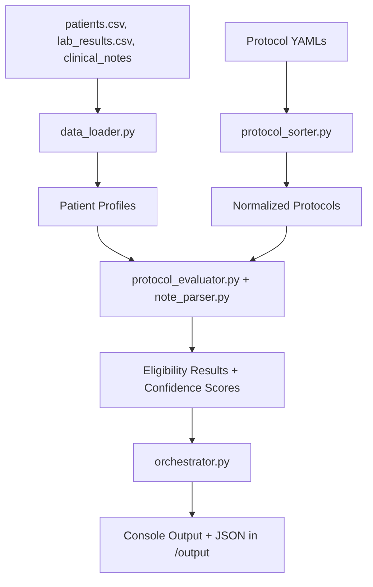

# Clinical Trial Eligibility System

This system evaluates patient eligibility against clinical trial protocols using structured data (demographics, labs) and unstructured data (clinical notes). Protocols are defined in YAML, normalized into criteria, and patients are evaluated against them. Results are printed in the console and written to JSON.

---

## 1. Architecture Overview

### Components
- **Data Loader (`data_loader.py`)**  
  Loads patient demographics, labs, and notes into unified profiles.

- **Protocol Sorter (`protocol_sorter.py`)**  
  Normalizes protocol YAML files into structured and unstructured criteria.

- **Evaluator (`protocol_evaluator.py`, `note_parser.py`)**  
  - Structured: compares numeric and categorical values (age, smoker status, labs).  
  - Unstructured: checks clinical notes using semantic similarity (MiniLM sentence-transformers).  
  Produces criterion-level evidence and confidence scores.

- **Orchestrator (`orchestrator.py`)**  
  Runs the workflow, sorts patients by eligibility, prints summaries, and writes JSON results.

### Data Flow (Mermaid)



---

## 2. Design Choices and Trade-offs

- **Semantic model**: MiniLM chosen for balance of speed and accuracy. Larger models could improve precision but would be slower and harder to deploy.  
- **Eligibility rule**: Any `FAIL` disqualifies a patient. Confidence scores are used only if no FAILs exist.  
- **Confidence scoring**: PASS = 1, MAYBE = 0.5, FAIL = 0. Simple and interpretable.  
- **Sorting**: Patients are grouped by eligibility (`True`, `"MAYBE"`, `False`) and then sorted by confidence score (descending).  
- **Dockerization**: Provides reproducibility across environments. Trade-off is added build/setup time.  

---

## 3. Scalability Considerations

For scaling to millions of patients:
- Use Parquet or Arrow instead of CSV for storage.  
- Use FAISS, Milvus, or another vector database for efficient similarity search.  
- Parallelize patient evaluation with Spark, Ray, or Dask.  
- Cache precomputed embeddings for clinical notes.  

---

## 4. Setup and Run Instructions

### Local (Python 3.9)

```bash
python3.9 -m venv venv
source venv/bin/activate   # Windows: venv\Scripts\activate
pip install -r requirements.txt
python src/orchestrator.py
```

### Docker

```bash
docker build -t clinical-trial-system .
docker run --rm \\
  -v $(pwd)/assignment_data:/app/assignment_data \\
  -v $(pwd)/output:/app/output \\
  clinical-trial-system
```

### Docker Compose

```bash
docker compose up --build
docker compose down
```

---

## 5. Example Output

### Console

```
=== Protocol: ONC-003-Prevention ===
Patient patient_C001 | confidence_score = 0.944 | is_eligible = True
Patient patient_C003 | confidence_score = 0.833 | is_eligible = True
Patient patient_C006 | confidence_score = 0.462 | is_eligible = MAYBE
Patient patient_C002 | confidence_score = NA | is_eligible = False
Protocol summary: 2/4 patients eligible (50.0%)
```

---

### JSON (`output/ONC-003-Prevention_results.json`)

Representative 4 patients, each with 9 criteria in evidence:

```json
[
  {
    "patient_id": "patient_C001",
    "is_eligible": true,
    "confidence_score": 0.944,
    "evidence": {
      "Patient must be between 50 and 70 years of age (inclusive).": "PASS (age=54 in range 50-70)",
      "Patient must not be a current smoker.": "PASS (is_smoker exactly False)",
      "HbA1c level must be less than 8.0%.": "MAYBE (no data for lab_result)",
      "Must be non-smoker for at least 5 years.": "PASS (semantic match, score=0.22)",
      "Family history of cancer in first-degree relatives.": "PASS (semantic match, score=0.29)",
      "Must have completed age-appropriate cancer screening.": "PASS (semantic match, score=0.42)",
      "No personal history of malignancy.": "PASS (semantic match, score=0.25)",
      "No current immunosuppressive therapy.": "PASS (semantic match, score=0.16)",
      "Moderate alcohol consumption within guidelines.": "PASS (semantic match, score=0.31)"
    }
  },
  {
    "patient_id": "patient_C003",
    "is_eligible": true,
    "confidence_score": 0.833,
    "evidence": {
      "Patient must be between 50 and 70 years of age (inclusive).": "PASS (age=58 in range 50-70)",
      "Patient must not be a current smoker.": "PASS (is_smoker exactly False)",
      "HbA1c level must be less than 8.0%.": "PASS (HbA1c=7.5, < 8.0)",
      "Must be non-smoker for at least 5 years.": "PASS (semantic match, score=0.20)",
      "Family history of cancer in first-degree relatives.": "MAYBE (weak semantic match, score=0.14)",
      "Must have completed age-appropriate cancer screening.": "PASS (semantic match, score=0.27)",
      "No personal history of malignancy.": "PASS (semantic match, score=0.20)",
      "No current immunosuppressive therapy.": "PASS (semantic match, score=0.16)",
      "Moderate alcohol consumption within guidelines.": "PASS (semantic match, score=0.19)"
    }
  },
  {
    "patient_id": "patient_C006",
    "is_eligible": "MAYBE",
    "confidence_score": 0.462,
    "evidence": {
      "Patient must be between 50 and 70 years of age (inclusive).": "PASS (age=62 in range 50-70)",
      "Patient must not be a current smoker.": "PASS (is_smoker exactly False)",
      "HbA1c level must be less than 8.0%.": "MAYBE (no data for lab_result)",
      "Must be non-smoker for at least 5 years.": "MAYBE (weak semantic match, score=0.12)",
      "Family history of cancer in first-degree relatives.": "MAYBE (weak semantic match, score=0.14)",
      "Must have completed age-appropriate cancer screening.": "PASS (semantic match, score=0.29)",
      "No personal history of malignancy.": "PASS (semantic match, score=0.21)",
      "No current immunosuppressive therapy.": "PASS (semantic match, score=0.21)",
      "Moderate alcohol consumption within guidelines.": "PASS (semantic match, score=0.25)"
    }
  },
  {
    "patient_id": "patient_C002",
    "is_eligible": false,
    "confidence_score": "NA",
    "evidence": {
      "Patient must be between 50 and 70 years of age (inclusive).": "FAIL (age=36 not in range 50-70)",
      "Patient must not be a current smoker.": "FAIL (is_smoker=True not equal False)",
      "HbA1c level must be less than 8.0%.": "MAYBE (no data for lab_result)",
      "Must be non-smoker for at least 5 years.": "PASS (semantic match, score=0.51)",
      "Family history of cancer in first-degree relatives.": "PASS (semantic match, score=0.16)",
      "Must have completed age-appropriate cancer screening.": "PASS (semantic match, score=0.31)",
      "No personal history of malignancy.": "MAYBE (weak semantic match, score=0.14)",
      "No current immunosuppressive therapy.": "PASS (semantic match, score=0.20)",
      "Moderate alcohol consumption within guidelines.": "PASS (semantic match, score=0.29)"
    }
  }
]
```

---

## 6. Expected Output Structure

Each protocol JSON result file is an array of patients. Each patient object contains:

- `patient_id`: string  
- `is_eligible`: boolean or `"MAYBE"`  
- `confidence_score`: decimal (0 - 1) or `"NA"` if disqualified  
- `evidence`: dictionary with exactly number of criteria descriptions, each mapped to a PASS/FAIL/MAYBE explanation  
