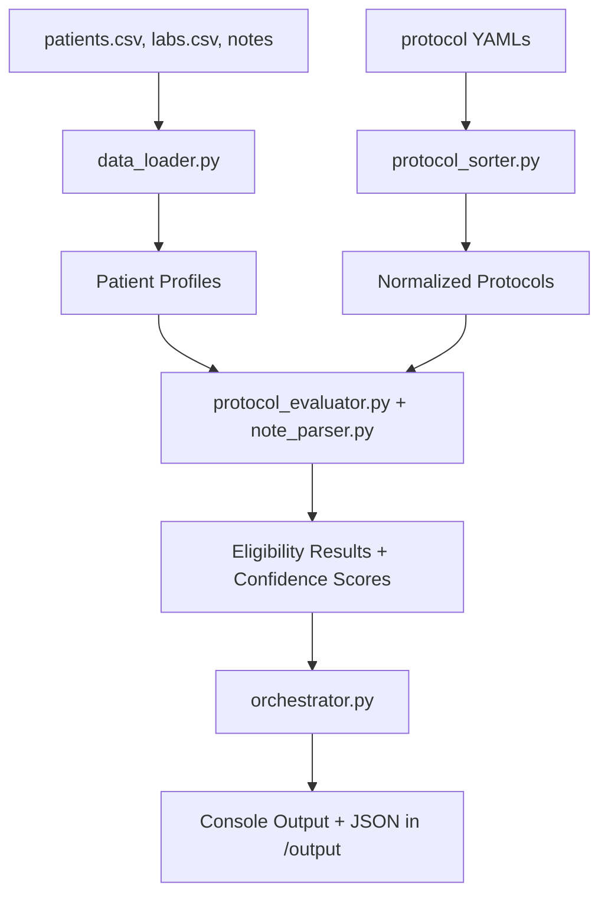

# 🧪 Medical Trial Workflow

This project evaluates patient eligibility against clinical trial protocols using structured (CSV) and unstructured (clinical notes) data. Protocols are defined in YAML, parsed into criteria, and patients are scored against them. Results are printed in the console and written to JSON files.

---

## 1. Architecture Overview

### System Design
- **Data Loader (`data_loader.py`)**
  Loads patient demographics, labs, and notes from CSV/TXT files into unified profiles.

- **Protocol Sorter (`protocol_sorter.py`)**
  Normalizes YAML protocol files into structured and unstructured criteria.

- **Evaluator (`protocol_evaluator.py`, `note_parser.py`)**
  Evaluates each patient against all criteria:
  - Structured: direct numeric and equality comparisons.
  - Unstructured: semantic search on notes with sentence-transformers.
  Produces evidence, confidence score, and eligibility decision.

- **Orchestrator (`orchestrator.py`)**
  Coordinates the workflow:
  - Runs evaluation for all patients and all protocols.
  - Sorts patients: True first, then MAYBE, then False.
  - Prints per-patient scores and summaries.
  - Writes JSON outputs to `/output`.

### Data Flow Diagram (Mermaid)



---

## 2. Design Choices & Trade-offs

- **Sentence-Transformers MiniLM**: Chosen for fast, lightweight semantic similarity. Trade-off: less accurate than larger models.  
- **Confidence scoring**: PASS=1, MAYBE=0.5, FAIL=0. Any FAIL automatically disqualifies a patient. Chosen for interpretability.  
- **Python 3.9**: Ensures compatibility with most ML/NLP libraries.  
- **Dockerization**: Provides reproducibility; trade-off is initial image size.  

---

## 3. Scalability Considerations

For **1 million patients**:
- **Storage**: Use Parquet/Arrow files on cloud storage instead of CSVs.  
- **Vector search**: Replace in-memory similarity with FAISS/Milvus or Pinecone.  
- **Distributed processing**: Use Spark or Ray to parallelize across patient profiles.  
- **Caching embeddings**: Pre-compute and store note embeddings to avoid recomputation.  

---

## 4. Setup & Run Instructions

### Option A: Local Python (3.9)

1. Create virtual environment:
   ```bash
   python3.9 -m venv venv
   source venv/bin/activate   # Windows: venv\Scripts\activate
   ```
2. Install dependencies:
   ```bash
   pip install -r requirements.txt
   ```
3. Run orchestrator:
   ```bash
   python src/orchestrator.py
   ```

---

### Option B: Docker

1. Build image:
   ```bash
   docker build -t medical-trial-workflow .
   ```
2. Run with mounted input/output:
   ```bash
   docker run --rm \\
     -v $(pwd)/assignment_data:/app/assignment_data \\
     -v $(pwd)/output:/app/output \\
     medical-trial-workflow
   ```

---

### Option C: Docker Compose

```bash
docker compose up --build
docker compose down
```

---

## 5. Output

### Console Example

```
=== Protocol: ONC-003-Prevention ===
Patient patient_C004 | confidence_score = 0.611 | is_eligible = True
Patient patient_C003 | confidence_score = 0.462 | is_eligible = MAYBE
Patient patient_C001 | confidence_score = NA | is_eligible = False
Patient patient_C002 | confidence_score = NA | is_eligible = False
Protocol summary: 1/4 patients eligible (25.0%)
```

### JSON Example (`output/ONC-003-Prevention_results.json`)

```json
[
  {
    "patient_id": "patient_C004",
    "is_eligible": true,
    "confidence_score": 0.611,
    "evidence": {
      "Age between 50 and 70": "PASS (age=54 in range 50-70)",
      "HbA1c < 8.0%": "MAYBE (no data for lab_result)",
      "No immunosuppressive therapy": "MAYBE (weak semantic match ...)"
    }
  },
  {
    "patient_id": "patient_C001",
    "is_eligible": false,
    "confidence_score": "NA",
    "evidence": {
      "Age between 50 and 70": "FAIL (age=75 not in range 50-70)",
      "...": "..."
    }
  }
]
```

---

## 6. Expected Output Structure

- A list of patients, each containing:
  - `patient_id`: string  
  - `is_eligible`: boolean or `"MAYBE"`  
  - `confidence_score`: float (0–1) or `"NA"` if disqualified  
  - `evidence`: dictionary mapping each criterion → PASS/FAIL/MAYBE explanation  
